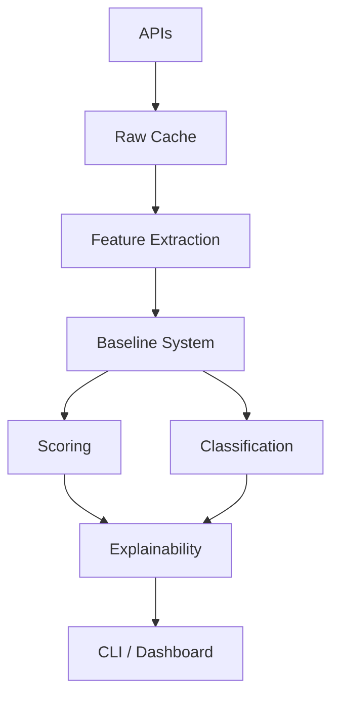

# OBSIDIAN MM Documentation

Welcome to the **OBSIDIAN MM** documentation!

**O**bservational **B**ehavioral **S**ystem for **I**nstitutional & **D**ealer-**I**nformed **A**nomaly **N**etworks — **M**arket **M**aker Regime Engine

---

## What is OBSIDIAN MM?

OBSIDIAN MM is a **diagnostic engine** that analyzes daily market microstructure patterns to classify institutional and dealer behavior into explainable regimes.

### Key Features

✅ **7 Market Microstructure Regimes**
- Γ⁺ (Gamma-Positive Control)
- Γ⁻ (Gamma-Negative Liquidity Vacuum)
- DD (Dark-Dominant Accumulation)
- ABS (Absorption-Like)
- DIST (Distribution-Like)
- NEU (Neutral / Mixed)
- UND (Undetermined)

✅ **Unusualness Scoring**
- Weighted absolute z-score sum
- Percentile-mapped [0, 100] scale
- Interpretation bands

✅ **Full Explainability**
- Regime triggering conditions
- Top feature contributors
- Excluded features with reasons
- Baseline state transparency

✅ **NaN Philosophy**
> "False negatives are acceptable. False confidence is not."

---

## Quick Links

<div class="grid cards" markdown>

-   :material-rocket-launch:{ .lg .middle } __Quick Start__

    ---

    Get up and running in 5 minutes

    [:octicons-arrow-right-24: Installation](installation.md)

-   :material-book-open-variant:{ .lg .middle } __User Guide__

    ---

    Learn how to use OBSIDIAN MM

    [:octicons-arrow-right-24: User Guide](user-guide/index.md)

-   :material-code-braces:{ .lg .middle } __API Reference__

    ---

    Complete developer documentation

    [:octicons-arrow-right-24: API Docs](api/index.md)

-   :material-flask:{ .lg .middle } __Examples__

    ---

    Practical usage examples

    [:octicons-arrow-right-24: Examples](examples/index.md)

</div>

---

## Example Output

```
=== OBSIDIAN MM Diagnostic: SPY @ 2024-01-15 ===

Regime: Γ⁻ (Gamma-Negative Liquidity Vacuum)
Z_GEX = -2.3100 (threshold: -1.5000) ✓
Impact_vs_median = 0.0087 (threshold: 0.0052) ✓

Unusualness: 78 (Unusual)
Top drivers: GEX contrib=0.58; DARK_SHARE contrib=0.46

Excluded: charm (n = 9 < 21)
Baseline: PARTIAL
```

**Interpretation**: Dealers are significantly short gamma (Z_GEX = -2.31), amplifying directional moves. Price impact is elevated, signaling a liquidity vacuum.

---

## Architecture



---

## Design Principles

### 1. NaN Philosophy
Missing data → NaN. Never imputed, interpolated, or approximated.

### 2. Instrument Isolation
Every instrument has its own baseline. No cross-contamination.

### 3. Fixed Weights
Feature weights are conceptual allocations, not optimized.

### 4. No Predictions
Diagnostic only — never forecasts prices or generates signals.

### 5. Explainability First
Every output includes full transparency about why.

---

## Getting Started

=== "CLI Usage"

    ```bash
    # Basic diagnostic
    python -m obsidian.cli diagnose SPY

    # With date
    python -m obsidian.cli diagnose SPY --date 2024-01-15

    # JSON output
    python -m obsidian.cli diagnose SPY --format json
    ```

=== "Python API"

    ```python
    from obsidian.engine import (
        Baseline,
        Scorer,
        Classifier,
        Explainer,
    )

    # Compute z-scores
    baseline = Baseline()
    z_scores = baseline.compute_z_scores(feature_data)

    # Score and classify
    scorer = Scorer()
    classifier = Classifier()

    scoring_result = scorer.compute_score(z_scores)
    regime_result = classifier.classify(...)

    # Generate explanation
    explainer = Explainer()
    output = explainer.explain(...)
    print(output.format_full())
    ```

---

## Resources

- **[User Guide](USER_GUIDE.md)** — End-user documentation
- **[API Reference](API.md)** — Developer documentation
- **[Specification](../reference/OBSIDIAN_MM_SPEC.md)** — Technical spec
- **[Examples](../examples/)** — Practical examples
- **[Contributing](../CONTRIBUTING.md)** — Contribution guidelines
- **[Changelog](../CHANGELOG.md)** — Version history

---

## Support

- **GitHub**: [aetherveil/obsidian-mm](https://github.com/aetherveil/obsidian-mm)
- **Issues**: [Report a bug](https://github.com/aetherveil/obsidian-mm/issues)
- **Discussions**: [Ask questions](https://github.com/aetherveil/obsidian-mm/discussions)

---

## License

Proprietary. All rights reserved.

---

*OBSIDIAN MM — Transparency in microstructure diagnostics*
